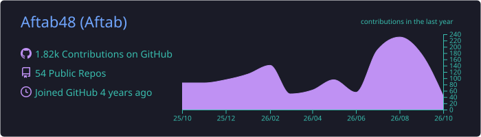
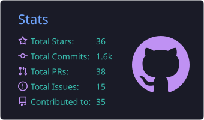
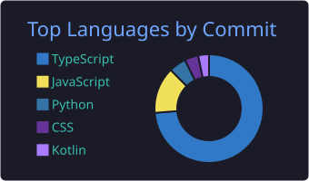

  
  
  

## ⚡ Tech I ship with

  

## 🚀 Featured projects

| Project | What it is | |
|---|---|---|
| **[Haemologix](https://github.com/Aftab48/Haemologix)** | 🩸 India's real-time emergency blood network: hospitals, blood banks and nearby donors |    |
| **[Haemologix---Donor](https://github.com/Aftab48/Haemologix---Donor)** | 📱 Donor app for Haemologix: live donation alerts, eligibility and history (React Native) |   |
| **[carepulse.app](https://github.com/Aftab48/carepulse.app)** | 🏥 B2B healthcare platform that cuts OPD queues: doctor and test booking, hospital workflows |    |
| **[CU-PG-Men-s-Students-Hall](https://github.com/Aftab48/CU-PG-Men-s-Students-Hall)** | 🍽️ Mess hall management app: meals, expenses and payments for managers, boarders and staff (Expo + Appwrite) |   |
| **[MeetSpace](https://github.com/Aftab48/MeetSpace)** | 🎥 Video meetings in the browser |    |
| **[casecobra](https://github.com/Aftab48/casecobra)** | 📦 Custom phone case store |    |

## 📊 Stats

  

  
  

  

